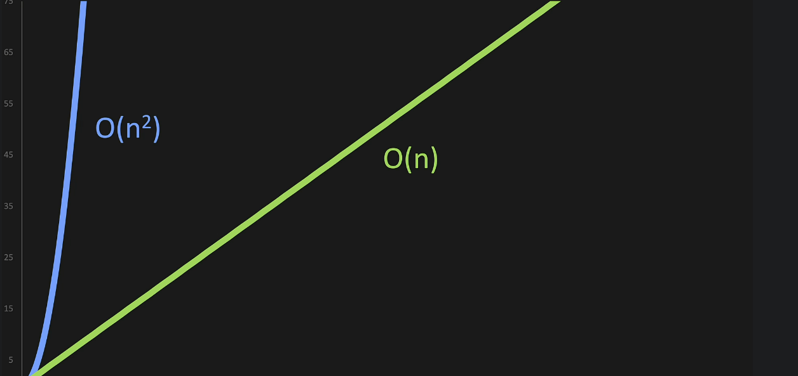
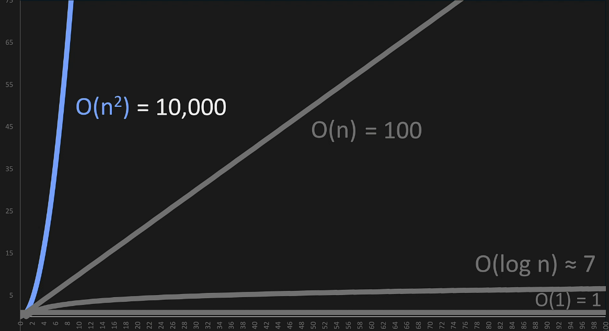

# Big O
***
***
# Big O Intro
* Big O is a way of comparing 2 sets of code
* Compares efficency 
* Time complexity 
* Space complexity - memory 

***
***
# Big O - Worst Case
* omega - best case
* theta - theta
* omnicrom - worst case
  * aka O

* meaning - looping through 1-7 and finding 1 is best case
* when talking about big O you are talking about worst case

***
***
# Big O - O(n)
* The example below is O(n)...
* You pass in the number n and it runs n times
* O(n) is always a straight line on a graph  - proportional 

```
def print_items(n):
    for i in range(n):
        print(i)
```

***
***
# Drop Constants
* this runs n + n times ... aka 2n times
* you could write it as O(2n) ... but you drop the constant and call it O(n)

```
def print_items(n):
    for i in range(n):
        print(i)

    for j in range(n):
        print(j)

print_items(10)
```

***
***
# Big O - O(n^2) (squared)
* you print n*n or n^2  - so your printing 99 items
```
def print_items(n):
    for i in range(n):
        for j in range(n):
            print(i,j)

print_items(10)
```
* this code below runs n*n*n or n^3 - so you print 999 times
* you might think it would be called O(n^3) but you would actually call it O(n^2)
* If its O(n^3) or 4 or 7... you would still call it O(n^2)
```
def print_items(n):
    for i in range(n):
        for j in range(n):
            for j in range (n):
                print(i,j,k)

print_items(10)
```
* If you look at the graph you can see that its more steep which means its less efficent from a time complexity standpoint
* 

***
***
# Big O - Drop Non-Dominants
* the nested portion goes to 99 - O(n^2)
* the un-nested for loop goes to 9 - O(n)
* the full output was O(n^2) + O(n) which is O(n^2 + 2)
* n is small in the equation above n^2 is the dominant term so you can drop the non dominant term and just write O(n^2)

```
def print_items(n):
    for i in range(n):
        for j in range(n):
            print(i,j)

    for k in range(n):
        print(k)

print_items(10)
```
***
***
# Big O: O(1)
* O(1) means one operation
* the item below only has one operation so its O(1)
```
def add_items(n):
    return n+n
```
* if it has more operations like this its still called O(1)
```
def add_items(n):
    return n+n+n
```
* O(1) is also called constant time - as it increased the number of operations is going to remain constant
* its constant:
* .png)
* O(1 is the most efficent Big O)

***
***
# Big O - O(log n)
* 2^3 = 8 is the same as log2 of 8 = 3
  * 2 to the what power = 8
  * how many times do you have to take the number 8 and divide it by 2 to get down to one item

*  log 2 of 1,073,741,842
   *  how many times do you have to cut this number in half to get to the number...that would be 31
   *  rather that iterate through something all of those times you can just cut it in half 31 times and find the item
* .png)

### O(nlog n)
* this is used with some sorting algorithms
* .png)
* ex: merge sort and quick sort

***
***
# Different Terms for Inputs

* this is O(2n), you drop the 2 so its O(n)
```
def print_items(n):
    for i in range(n):
        print(i)

    for j in range(n):
        print(j)
```
* this below is not O(n) - there are multiple paramaters
* its is O(a) and O(b) ... so its O(a + b)
```
def print_items(a, b):
    for i in range(a):
        print(i)

    for j in range(b):
        print(j)
```
* this below is O(a * b)
```
def print_items(a, b):
    for i in range(a):
        for j in range(b):
            print(i,j)
```

***
***
# Big O - Lists

* for append or pop you are just doing one operation so that is O(1)
```
my_list = [11,3,23,7]
my_list.append(17)
my_list.pop()
```
* the items below are O(n) because you have to re-index each item
* n is the number of items in the list
```
my_list.pop(0)
my_list.insert(0,11)
```
* This is inserting in the middle and it only has to reindex some of the list items... its is still O(n though)
* big O measures worst case not average case - and remember you drop the constants
```
my_list.insert(1,"Hi")
```
* if you loop through a list to find the item its O(n)
* if you look through a list specifically with an index then its O(1)  because you are going directly to the location

***
***
# Big O - Wrap Up
* big O cheatsheet: https://www.bigocheatsheet.com/
* 
* the spread becomes larger as O gets bigger
* O(1) is most efficent
* O(n^2) is the least efficent

* O(n^2)
  * This is a loop within a loop
* O(n)
  * This is proportional
* O(log n)
  * Divide and Conquer
* O(1) 
  * Constant