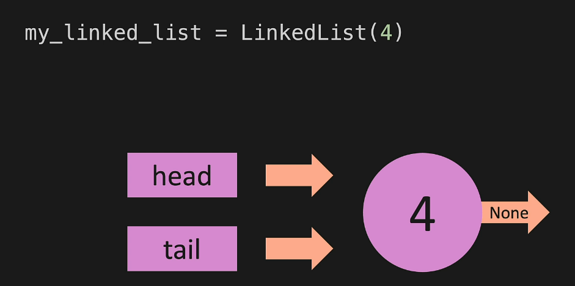

# Linked Lists
***
***
# Linked List - Intro
* a linked list does not have indexes
* with a normal list all of items are lined up next to eachother in memory - which is why you can have indexes 
* with a linked list all of the nodes are spread across memory
* 
* linked list in memory:
* 

***
***
# LL - Big O
* append - O(1)
  * you just add 1 item
* remove item from the end - O(n)
  * you have to set a new tail 
  * to find what points to the tail you have to iterate through each item
  * because you are iterating through the items that is O(n)
* append an item to the front of the list - O(1)
  * you are just adding to the front and changin the head pointer so its just 1 operation
* pop/remove the item from the front - O(1)
  * one operation so O(1)
* add an item to the middle of a list - O(n)
  * you have to iterate through the list to find where the item should go, and you have to find the pointers so its O(n)
* remove an item from the middle of the list - O(n)
  * you have to iterate through the list to find the point
* lookup / find an item in a list - O(n)
  * you have to iterate through the list to find the items so its O(n)
  * normal lists allow you to go directly to the item with an index but you cant do that with a linked list
* 

***
***
# LL - Under the hood
* a node in a linked list is the value AND the pointer
* a node is essentially a dictionary - you can think of it that way atleast
```
{
"value": 7,
"next": {
          "value": 4,
          "next": None
        }
}
```
***
***
# LL - Constructor
* if you look at the code below there is a good bit of repitition
* it creates the node multiple times
```
class LinkedList:
    def __init__(self, value):
        # constructor - creates new node and initalizes the new linked list
        self.value = value
    
    def append(self, value):
        # creates a new node and adds it to the end

    def prepend(self, value):
        # creates a new nose and prepends it to the beginning 

    def insert(self, inded, value)
        # creates a new node and inserts it 
    
```
* to be more efficent we can make a new class called node which creates nodes
```
class Node:
    def __init__(self, value):
        self.value = value
        self.next = None

class LinkedList:
    def __init__(self, value):
        new_node = Node(value)
        self.head = new_node
        self.tail = new_node
        self.length = 1

# make the linked list
my_linked_list = LinkedList(4)

# this will print 4
print(my_linked_list.head.value)
```
* when you create it you are creating this
* 

***
***
# LL - Print List
* you can make a method to print the linked lists
* remember after the tail the pointer points to None
```
def print_list(self):
    temp = self.head
    while temp is not None:
        print(temp.value)
        temp = temp.next
```

***
***
# LL - Append
```
class Node:
    def __init__(self, value):
        self.value = value
        self.next = None

class LinkedList:
    def __init__(self, value):
        new_node = Node(value)
        self.head = new_node
        self.tail = new_node
        self.length = 1

    def print_list(self):
    temp = self.head
    while temp is not None:
        print(temp.value)
        temp = temp.next
    
    def append(self, value):
        new_node = Node(value)
        if self.head is None:
            self.head = new_node
            self.tail = new_node
        else:
            self.tail.next = new_node
            self.tail = new_node
        self.length += 1
        return True  #  optional if its just a stand alone method

    def prepend(self, value):
        ...

    def insert(self, inded, value)
        ...
    
my_linked_list = LinkedList(1)
my_linked_list.append(2)
my_linked_list.print_list()
```

***
***
# LL - Pop Intro
```
class Node:
    def __init__(self, value):
        self.value = value
        self.next = None

class LinkedList:
    def __init__(self, value):
        new_node = Node(value)
        self.head = new_node
        self.tail = new_node
        self.length = 1

    def print_list(self):
    temp = self.head
    while temp is not None:
        print(temp.value)
        temp = temp.next
    
    def pop(self, value):
        if self.length == 0:
            return None
        temp = self.head
        pre = self.head
        while(temp.next):  # while its true - is it pointing to a node
           pre = temp
           temp = temp.next
        self.tail = pre
        self.tail.next = None  #  breaking off the last item from the list
        self.length -= 1
        if self.length == 0:
            self.head = None
            self.tail = None
        return temp


    def prepend(self, value):
        ...

    def insert(self, inded, value)
        ...
    
my_linked_list = LinkedList(1)
my_linked_list.pop(2)
my_linked_list.print_list()
```

***
***
# LL - Prepend

```
class Node:
    def __init__(self, value):
        self.value = value
        self.next = None

class LinkedList:
    def __init__(self, value):
        new_node = Node(value)
        self.head = new_node
        self.tail = new_node
        self.length = 1

    def print_list(self):
    temp = self.head
    while temp is not None:
        print(temp.value)
        temp = temp.next
    
    def pop(self, value):
        ...


    def prepend(self, value):
        new_node = Node(value)
        if self.length == 0:
            self.head = new_node
            self.tail = new_node
        else: 
            new_node.next = self.head
            self.head = new_node
        self.length += 1
        return True
        

    def insert(self, inded, value)
        ...
    
my_linked_list = LinkedList(1)
my_linked_list.prepend(2)
my_linked_list.print_list()
```

***
***
# LL - Pop first
```
class Node:
    def __init__(self, value):
        self.value = value
        self.next = None

class LinkedList:
    def __init__(self, value):
        new_node = Node(value)
        self.head = new_node
        self.tail = new_node
        self.length = 1

    def print_list(self):
    temp = self.head
    while temp is not None:
        print(temp.value)
        temp = temp.next
    
    def pop(self, value):
        ...


    def prepend(self, value):
        ...
        

    def insert(self, inded, value)
        ...

    def pop_first(self):
        if self.length == 0:
            return None
        temp = self.head
        self.head = self.head.next
        temp.next = None
        self.length -= 1 
        if self.length == 0:
            self.tail = None
        return temp

    
my_linked_list = LinkedList(1)
my_linked_list.append(2)
my_linked_list.pop_first()
my_linked_list.print_list()
``` 

***
***
# LL - Get

```
class Node:
    def __init__(self, value):
        self.value = value
        self.next = None

class LinkedList:
    def __init__(self, value):
        new_node = Node(value)
        self.head = new_node
        self.tail = new_node
        self.length = 1

    def print_list(self):
    temp = self.head
    while temp is not None:
        print(temp.value)
        temp = temp.next
    
    def pop(self, value):
        ...


    def prepend(self, value):
        ...
        

    def insert(self, inded, value)
        ...

    def pop_first(self):
        ...

    def get(self, index):
        if index < 0 or index >= self.length:
            return None 
        temp = self.head
        for _ in range(index):
            temp = temp.next
        return temp

    
my_linked_list = LinkedList(1)
my_linked_list.append(2)
my_linked_list.get(1)
my_linked_list.print_list()
``` 

***
***
# LL - Get

```
class Node:
    def __init__(self, value):
        self.value = value
        self.next = None

class LinkedList:
    def __init__(self, value):
        new_node = Node(value)
        self.head = new_node
        self.tail = new_node
        self.length = 1

    def print_list(self):
    temp = self.head
    while temp is not None:
        print(temp.value)
        temp = temp.next
    
    def pop(self, value):
        ...


    def prepend(self, value):
        ...
        

    def insert(self, inded, value)
        ...

    def pop_first(self):
        ...
    
    def get(self, index):
        if index < 0 or index >= self.length:
            return None 
        temp = self.head
        for _ in range(index):
            temp = temp.next
        return temp

    def set_value(self, index, value):
        temp = self.get(index)
        if temp:
            temp.value = value
            return True
        return False
        

    
my_linked_list = LinkedList(1)
my_linked_list.append(2)
my_linked_list.set_value(1,4)
my_linked_list.print_list()
``` 

***
***
# LL - Insert

```
class Node:
    def __init__(self, value):
        self.value = value
        self.next = None

class LinkedList:
    def __init__(self, value):
        new_node = Node(value)
        self.head = new_node
        self.tail = new_node
        self.length = 1

    def print_list(self):
    temp = self.head
    while temp is not None:
        print(temp.value)
        temp = temp.next
    
    def pop(self, value):
        if self.length == 0:
            return None
        temp = self.head
        pre = self.head
        while(temp.next):  # while its true - is it pointing to a node
           pre = temp
           temp = temp.next
        self.tail = pre
        self.tail.next = None  #  breaking off the last item from the list
        self.length -= 1
        if self.length == 0:
            self.head = None
            self.tail = None
        return temp

    def pop_first(self):
        if self.length == 0:
            return None
        temp = self.head
        self.head = self.head.next
        temp.next = None
        self.length -= 1 
        if self.length == 0:
            self.tail = None
        return temp

    def prepend(self, value):
        new_node = Node(value)
        if self.length == 0:
            self.head = new_node
            self.tail = new_node
        else: 
            new_node.next = self.head
            self.head = new_node
        self.length += 1
        return True
        

    def insert(self, inded, value)
        if index < 0 or index > self.length:
            return False
        if index == 0:
            return self.prepend(value)
        if index == self.length:
            return self.append(value)
        new_node = Node(value)
        temp = self.get(index - 1)
        new_node.next = temp.next
        temp.next = new_node
        self.length += 1
        return True

    def pop_first(self):
        if self.length == 0:
            return None
        temp = self.head
        self.head = self.head.next
        temp.next = None
        self.length -= 1 
        if self.length == 0:
            self.tail = None
        return temp
    
    def get(self, index):
        if index < 0 or index >= self.length:
            return None 
        temp = self.head
        for _ in range(index):
            temp = temp.next
        return temp

    def set_value(self, index, value):
        temp = self.get(index)
        if temp:
            temp.value = value
            return True
        return False
        

    
my_linked_list = LinkedList(1)
my_linked_list.append(2)
my_linked_list.insert(1,1)
my_linked_list.print_list()
``` 

***
***
# LL - Remove

```
class Node:
    def __init__(self, value):
        self.value = value
        self.next = None

class LinkedList:
    def __init__(self, value):
        new_node = Node(value)
        self.head = new_node
        self.tail = new_node
        self.length = 1

    def print_list(self):
    temp = self.head
    while temp is not None:
        print(temp.value)
        temp = temp.next
    
    def pop(self, value):
        if self.length == 0:
            return None
        temp = self.head
        pre = self.head
        while(temp.next):  # while its true - is it pointing to a node
           pre = temp
           temp = temp.next
        self.tail = pre
        self.tail.next = None  #  breaking off the last item from the list
        self.length -= 1
        if self.length == 0:
            self.head = None
            self.tail = None
        return temp


    def prepend(self, value):
        new_node = Node(value)
        if self.length == 0:
            self.head = new_node
            self.tail = new_node
        else: 
            new_node.next = self.head
            self.head = new_node
        self.length += 1
        return True
        

    def insert(self, inded, value)
        if index < 0 or index > self.length:
            return False
        if index == 0:
            return self.prepend(value)
        if index == self.length:
            return self.append(value)
        new_node = Node(value)
        temp = self.get(index - 1)
        new_node.next = temp.next
        temp.next = new_node
        self.length += 1
        return True

    def pop_first(self):
        if self.length == 0:
            return None
        temp = self.head
        self.head = self.head.next
        temp.next = None
        self.length -= 1 
        if self.length == 0:
            self.tail = None
        return temp
    
    def get(self, index):
        if index < 0 or index >= self.length:
            return None 
        temp = self.head
        for _ in range(index):
            temp = temp.next
        return temp

    def pop_first(self):
        if self.length == 0:
            return None
        temp = self.head
        self.head = self.head.next
        temp.next = None
        self.length -= 1 
        if self.length == 0:
            self.tail = None
        return temp

    def set_value(self, index, value):
        temp = self.get(index)
        if temp:
            temp.value = value
            return True
        return False
        
    def remove(self.index):
        if index < 0 or index >= self.length:
            return None
        if index == 0:
            return self.pop_first()
        if index == self.length -1:
            return self.pop()
        prev = self.get(index - 1)
        temp = prev.next
        prev.next = temp.next
        temp.next = None
        self.length -= 1
        return temp

    
my_linked_list = LinkedList(1)
my_linked_list.append(2)
my_linked_list.remove(1)
my_linked_list.print_list()
``` 

***
***
# LL - Reverse
* take head and tail and switch them
* then reverse the next arrows
```
class Node:
    def __init__(self, value):
        self.value = value
        self.next = None

class LinkedList:
    def __init__(self, value):
        new_node = Node(value)
        self.head = new_node
        self.tail = new_node
        self.length = 1

    def print_list(self):
    temp = self.head
    while temp is not None:
        print(temp.value)
        temp = temp.next
    
    def pop(self, value):
        if self.length == 0:
            return None
        temp = self.head
        pre = self.head
        while(temp.next):  # while its true - is it pointing to a node
           pre = temp
           temp = temp.next
        self.tail = pre
        self.tail.next = None  #  breaking off the last item from the list
        self.length -= 1
        if self.length == 0:
            self.head = None
            self.tail = None
        return temp


    def prepend(self, value):
        new_node = Node(value)
        if self.length == 0:
            self.head = new_node
            self.tail = new_node
        else: 
            new_node.next = self.head
            self.head = new_node
        self.length += 1
        return True
        

    def insert(self, inded, value)
        if index < 0 or index > self.length:
            return False
        if index == 0:
            return self.prepend(value)
        if index == self.length:
            return self.append(value)
        new_node = Node(value)
        temp = self.get(index - 1)
        new_node.next = temp.next
        temp.next = new_node
        self.length += 1
        return True

    def pop_first(self):
        if self.length == 0:
            return None
        temp = self.head
        self.head = self.head.next
        temp.next = None
        self.length -= 1 
        if self.length == 0:
            self.tail = None
        return temp
    
    def get(self, index):
        if index < 0 or index >= self.length:
            return None 
        temp = self.head
        for _ in range(index):
            temp = temp.next
        return temp

    def pop_first(self):
        if self.length == 0:
            return None
        temp = self.head
        self.head = self.head.next
        temp.next = None
        self.length -= 1 
        if self.length == 0:
            self.tail = None
        return temp

    def set_value(self, index, value):
        temp = self.get(index)
        if temp:
            temp.value = value
            return True
        return False
        
    def remove(self.index):
        if index < 0 or index >= self.length:
            return None
        if index == 0:
            return self.pop_first()
        if index == self.length -1:
            return self.pop()
        prev = self.get(index - 1)
        temp = prev.next
        prev.next = temp.next
        temp.next = None
        self.length -= 1
        return temp

    def reverse(self):
        temp = self.head
        self.head = self.tail
        self.tail = temp
        after = temp.next
        before = None
        for _ in range(self.length):
            after = temp.next
            temp.next = before
            before = temp
            temp = after

    
my_linked_list = LinkedList(1)
my_linked_list.append(2)
my_linked_list.reverse()
my_linked_list.print_list()
```

***
***
# LL - Wrap Up
* Removing an item from the beginning of a Linked List is: O(1)
  * This is a place where Linked Lists are better than Lists. Lists are O(n) when removing the first item because of the reindexing that is required.
* Finding an item by index in a Linked List is: O(n)
  * You have to iterate through the Linked List until you get to the index you are looking for.
* Removing an item from the tail end of a Linked List is: O(n)
  * Because you have to start at the beginning of the Linked List an iterate through to the end