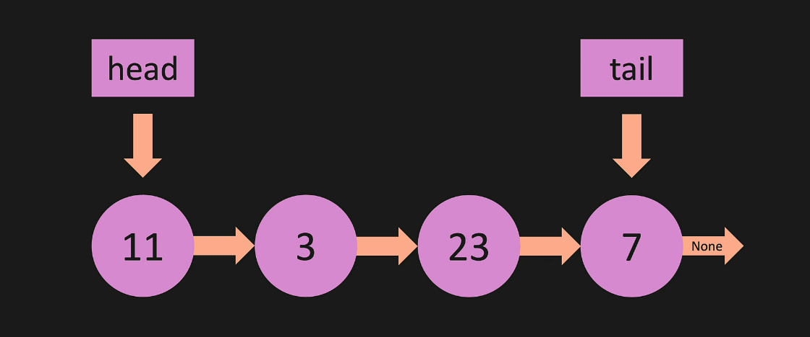
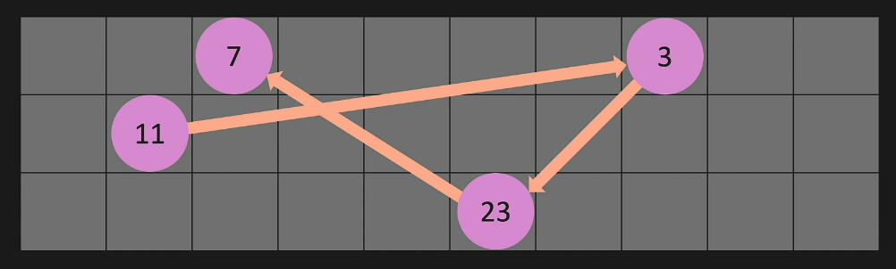
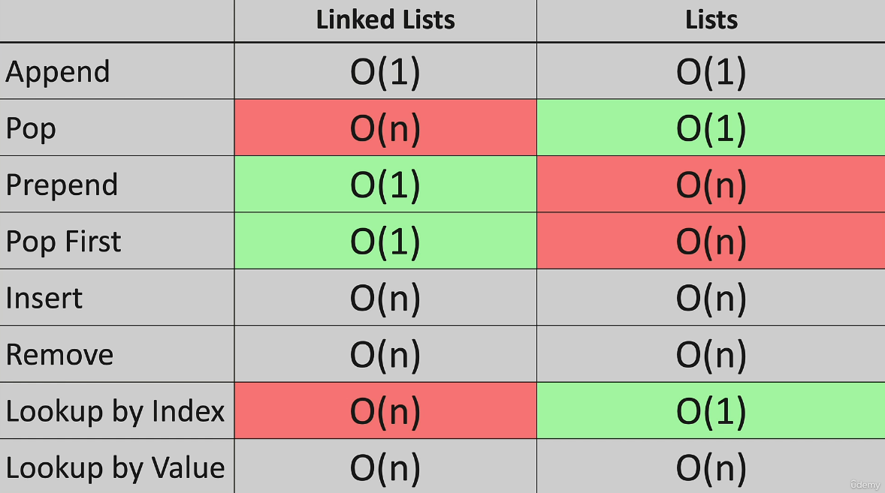

# Linked Lists
***
***
# Linked List - Intro
* a linked list does not have indexes
* with a normal list all of items are lined up next to eachother in memory - which is why you can have indexes 
* with a linked list all of the nodes are spread across memory
* 
* linked list in memory:
* 

***
***
# LL - Big O
* append - O(1)
  * you just add 1 item
* remove item from the end - O(n)
  * you have to set a new tail 
  * to find what points to the tail you have to iterate through each item
  * because you are iterating through the items that is O(n)
* append an item to the front of the list - O(1)
  * you are just adding to the front and changin the head pointer so its just 1 operation
* pop/remove the item from the front - O(1)
  * one operation so O(1)
* add an item to the middle of a list - O(n)
  * you have to iterate through the list to find where the item should go, and you have to find the pointers so its O(n)
* remove an item from the middle of the list - O(n)
  * you have to iterate through the list to find the point
* lookup / find an item in a list - O(n)
  * you have to iterate through the list to find the items so its O(n)
  * normal lists allow you to go directly to the item with an index but you cant do that with a linked list
* 

***
***
# LL - Under the hood
* 