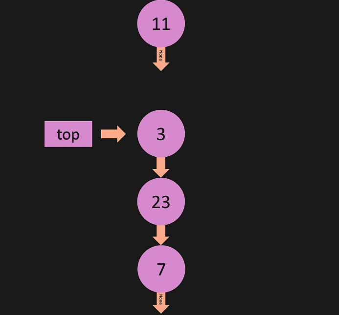

# Stacks and Queues
***
***
# Stack - Intro
* stacks are like tennis balls
* you can push an item onto the stack
* you can only get to the first item in the stack - so if you have two items you can only get the last item that you put in the stack
* its called LIFO - last in first out 
* example use case: the history in a web browser - when you click the back button it goes to the last site, then the site before, etc...
* if you are using a list for your stack then you want to remove the items from the back
  * if you remove them from the back then you dont have to re-index and the operation is O(1)
  * if you remove from the front then the operation is O(n)

* stack with a linked list:
  * you want the ll to look like this: node -> node -> none
  * this when you can add and remove from the front which is 0(1)
* stacks are commonly implemented with lists or linked lists
***
***
# Stack - constructor


```
class Node:
    def __init__(self, value):
        self.value = value
        self.next = None

class Stack:
    def__init__(self, value):
        new_node = Node(value)
        self.top = new_node
        self.bottom = new_node
        self.height = 1

    def print_stack(self):
        temp = self.top
        while temp is not None:
           print(temp.value)
           temp = temp.next
```

***
***
# Stack - push
* 

```
class Node:
    def __init__(self, value):
        self.value = value
        self.next = None

class Stack:
    def__init__(self, value):
        new_node = Node(value)
        self.top = new_node
        self.bottom = new_node
        self.height = 1

    def print_stack(self):
        temp = self.top
        while temp is not None:
           print(temp.value)
           temp = temp.next

    def push(self, value):
        new_node = new_node(value)
        if self.height == 0:
            self.top = new_node
        else:
            new_node.next = self.top
            self.top = new_node
        self.height += 1

my_stack = Stack(2)
my_stack.push(1)

my_stack.print_stack()
```

***
***
# Stack - Pop


```
class Node:
    def __init__(self, value):
        self.value = value
        self.next = None
        

class Stack:
    def __init__(self, value):
        new_node = Node(value)
        self.top = new_node
        self.height = 1

    def print_stack(self):
        temp = self.top
        while temp is not None:
            print(temp.value)
            temp = temp.next

    def push(self, value):
        new_node = Node(value)
        if self.height == 0:
            self.top = new_node
        else:
            new_node.next = self.top
            self.top = new_node
        self.height += 1
        return True

    def pop(self):
        temp = self.top
        if self.height == 0:
            return None
        self.top = temp.next
        temp.next = None
        self.height -= 1
        return temp
    

my_stack = Stack(7)
my_stack.push(23)
my_stack.push(3)
my_stack.push(11)

print(my_stack.pop(), '\n')

my_stack.print_stack()
```

***
***
# Queue - Intro
* a queue is like getting in line - if you are there first then you are the first person out of the line
* queue's are FIFO - first in first out 
* adding to the queue - called enqueue
* removing things from the queue - called dequeue
* in a queue you add on one end and remove on the other end
* ex data structures that you could use to create a queue:
  * list: 
    * removing and adding from the end is O(1)
    * removing and adding from the start is O(n) because you have to reindex
  * linked list:
    * removing from the end is O(n)
    * adding to the end is O(1)
    * removing from the start is O(1)
    * adding to the start is O(1)
    * so you would want to dequeue from the start of the linked list which is O(1)

***
***
# Queue constructor:

```
class Node:
    def__init__(self, value):
        self.value = value
        self.next = None

class Queue:
    def __init__(self, value):
        new_node = Node(value)
        self.first = new_node
        self.last = new_node
        self.length = 1

    def print_queue(self):
        temp = self.first
        while temp is not None:
            print(temp.value)
            temp = temp.next

my_queue = Queue(4)

my_queue.print_queue()
```

***
***
# Queue - Enqueue (Add)
* queue: node -> node -> node -> new node
* the new node is added to the end

```
class Node:
    def __init__(self, value):
        self.value = value
        self.next = None
        

class Queue:
    def __init__(self, value):
        new_node = Node(value)
        self.first = new_node
        self.last = new_node
        self.length = 1

    def print_queue(self):
        temp = self.first
        while temp is not None:
            print(temp.value)
            temp = temp.next
        
    def enqueue(self, value):
        new_node = Node(value)
        if self.first is None:
            self.first = new_node
            self.last = new_node
        else:
            self.last.next = new_node
            self.last = new_node
        self.length += 1
        

my_queue = Queue(1)
my_queue.enqueue(2)

my_queue.print_queue()
```

***
***
# Queue - Dequeue (remove)
* queue: first node -> node -> node
* in this example you are removing from the first node
 
```
class Node:
    def __init__(self, value):
        self.value = value
        self.next = None
        

class Queue:
    def __init__(self, value):
        new_node = Node(value)
        self.first = new_node
        self.last = new_node
        self.length = 1

    def print_queue(self):
        temp = self.first
        while temp is not None:
            print(temp.value)
            temp = temp.next
        
    def enqueue(self, value):
        new_node = Node(value)
        if self.first is None:
            self.first = new_node
            self.last = new_node
        else:
            self.last.next = new_node
            self.last = new_node
        self.length += 1
        return True

    def dequeue(self):
        if self.length == 0:
            return None
        temp = self.first
        if self.length == 1:
            self.first = None
            self.last = None
        else:
            self.first = self.first.next
            temp.next = None
        self.length -= 1
        return temp

 
my_queue = Queue(1)
my_queue.enqueue(2)

# (2) Items - Returns 2 Node
print(my_queue.dequeue())
# (1) Item -  Returns 1 Node
print(my_queue.dequeue())
# (0) Items - Returns None
print(my_queue.dequeue())
```

***
***
