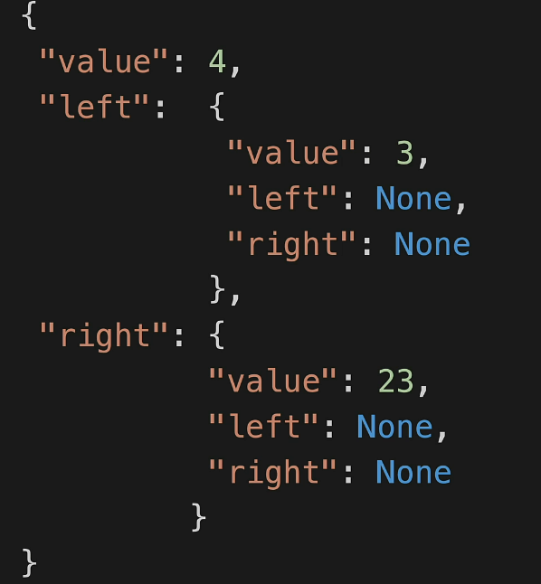
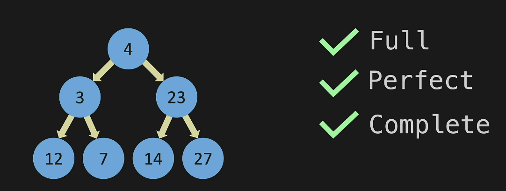
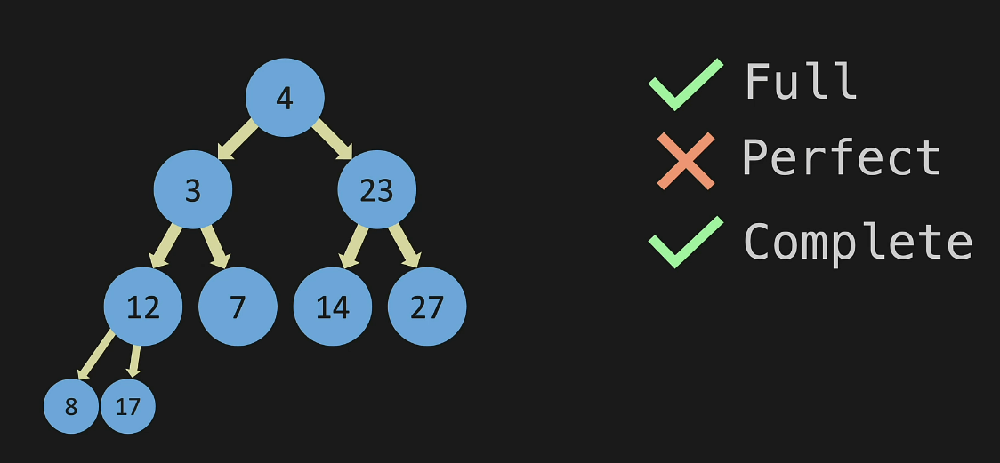
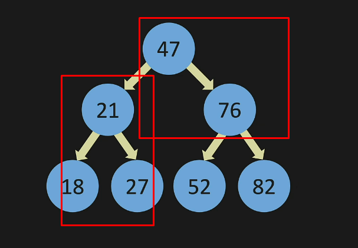

# Trees
***
***
# Trees Intro and Terminology
* a linked list is a form of a tree - just with no branches
* a binary tree will have 2 branches and will look something like this:
```
{
    "value": 4,
    "left": None,
    "right": None
}
```
* 
* you can think about it like this:
* 
* trees can point to many nodes but the examples below will be a binary tree (2)
  * the new nodes below can also branch off and point to other nodes
* a full tree is when each node points to 0 or 2 nodes
* a perfect tree is when each level is filled all the way across - also called a complete tree
* 
* 
* terms:
  * parent - has sub nodes
  * child - has a parent
  * leaf - is a child but is not a parent

***
***
# Binary Search Tree
* a binary tree is not the same as a binary search tree
* adding nodes to binary search trees
  * if the number is greater that the parent it goes on the right
  * if the number is less than the parent it goes on the left
* notice the pattern here:
* 
* level 1 in a tree is 2^1
* level 2 in a tree is 2^2
* level 2 in a tree is 2^3
* to find the number on level 3 you are interating down the tree 3 times - 3 steps
* so to look for a node in a bst is O(log n)
  * O(log n) is very efficent - it is divide and conquer
* is a bst never forks it is essentialy a linked list - if it never forks it is O(n)
* technically the Big O for bst is O(n) not O(log n) - but you can treat it as O(log n)
* comparing bst to linked list:
  * lookup: bst > ll
  * remove: bst > ll
  * insert: ll > bst (in a linked list you just append)

***
***
# BST - Constructor
* code for making a node 
* this code creates an empty bst
```
class Node:
    def __init__(self, value):
        self.value = value
        self.left = None
        self.right = None
        

class BinarySearchTree:
    def __init__(self):
        self.root = None # the head


my_tree = BinarySearchTree()

print(my_tree.root)
```

***
***
# BST - Insert Intro

```
class Node:
    def __init__(self, value):
        self.value = value
        self.left = None
        self.right = None
        

class BinarySearchTree:
    def __init__(self):
        self.root = None

    def insert(self, value):
        new_node = Node(value)
        if self.root is None:
            self.root = new_node
            return True
        temp = self.root
        while (True):
            if new_node.value == temp.value:
                return False
            if new_node.value < temp.value:
                if temp.left is None:
                    temp.left = new_node
                    return True
                temp = temp.left
            else: 
                if temp.right is None:
                    temp.right = new_node
                    return True
                temp = temp.right


my_tree = BinarySearchTree()
my_tree.insert(2)
my_tree.insert(1)
my_tree.insert(3)


print(my_tree.root.value)            
print(my_tree.root.left.value)        
print(my_tree.root.right.value)        
```

***
***
# BST - Contains

```
class Node:
    def __init__(self, value):
        self.value = value
        self.left = None
        self.right = None
        

class BinarySearchTree:
    def __init__(self):
        self.root = None

    def insert(self, value):
        new_node = Node(value)
        if self.root is None:
            self.root = new_node
            return True
        temp = self.root
        while (True):
            if new_node.value == temp.value:
                return False
            if new_node.value < temp.value:
                if temp.left is None:
                    temp.left = new_node
                    return True
                temp = temp.left
            else: 
                if temp.right is None:
                    temp.right = new_node
                    return True
                temp = temp.right

    def contains(self, value):
        temp = self.root
        while (temp is not None):
            if value < temp.value:
                temp = temp.left
            elif value > temp.value:
                temp = temp.right
            else:
                return True
        return False
        


my_tree = BinarySearchTree()
my_tree.insert(47)
my_tree.insert(21)
my_tree.insert(76)
my_tree.insert(18)
my_tree.insert(27)
my_tree.insert(52)
my_tree.insert(82)


print(my_tree.contains(27))

print(my_tree.contains(17))
```

***
***
# BST - Minimum value
* find the minimum value beneath a provided node:
```
def min_value_node(self, current_node):
    while current_node.left is not None:
      current_node = current_node.left
    return current_node
```

***
***
# BST - Summary
* Binary Search Trees always have a better Big O than Linked Lists:
  * An insert into a Binary Search Tree is typically (log n). Appending an item onto the end of a Linked List is O(1)..
* Adding an item to a Binary Search Tree is O(log n):
  * Omega (best case) and Theta (average case) are both (log n). However, worst case is O(n) and Big O measures worst case.