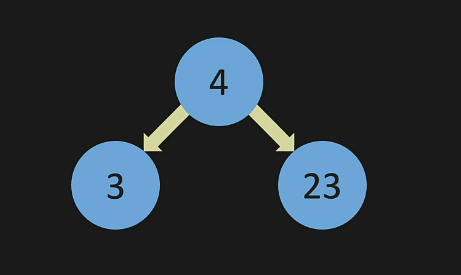

# Trees
***
***
# Trees Intro and Terminology
* a linked list is a form of a tree - just with no branches
* a binary tree will have 2 branches and will look something like this:
```
{
    "value": 4,
    "left": None,
    "right": None
}
```
* 
* you can think about it like this:
* 
* trees can point to many nodes but the examples below will be a binary tree (2)
  * the new nodes below can also branch off and point to other nodes
* a full tree is when each node points to 0 or 2 nodes
* a perfect tree is when each level is filled all the way across - also called a complete tree
* 
* 
* terms:
  * parent - has sub nodes
  * child - has a parent
  * leaf - is a child but is not a parent

***
***
# Binary Search Tree
* a binary tree is not the same as a binary search tree
* adding nodes to binary search trees
  * if the number is greater that the parent it goes on the right
  * if the number is less than the parent it goes on the left
* notice the pattern here:
* 
* level 1 in a tree is 2^1
* level 2 in a tree is 2^2
* level 2 in a tree is 2^3
* to find the number on level 3 you are interating down the tree 3 times - 3 steps
* so to look for a node in a bst is O(log n)
  * O(log n) is very efficent - it is divide and conquer
* is a bst never forks it is essentialy a linked list - if it never forks it is O(n)
* technically the Big O for bst is O(n) not O(log n) - but you can treat it as O(log n)
* comparing bst to linked list:
  * lookup: bst > ll
  * remove: bst > ll
  * insert: ll > bst (in a linked list you just append)

***
***
# 