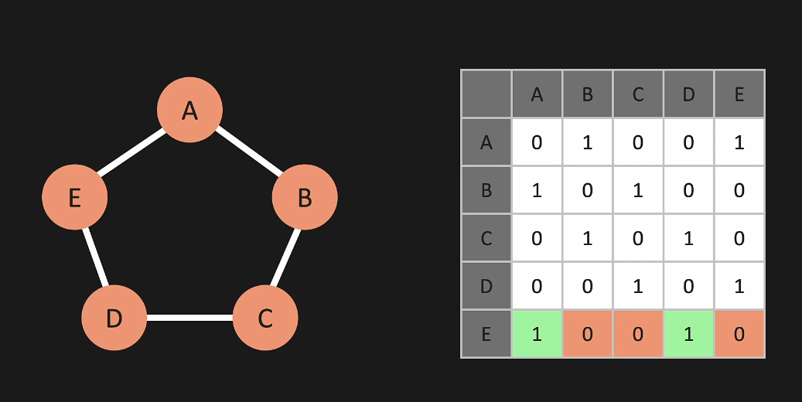
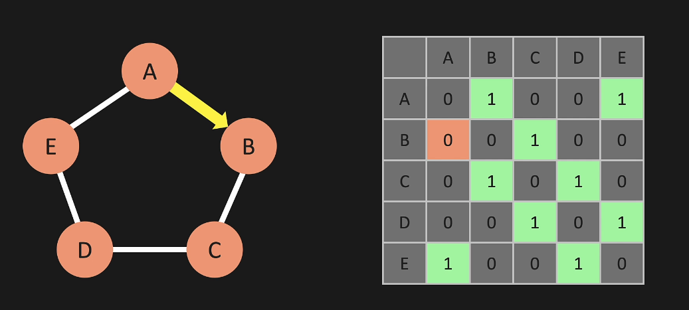

# Graphs
***
***
# Graph Intro
* vertex / node
* between the verticies you have whats called an "edge or connection"
* there is no limit to how many other vertacies a vertex can connect to
* with graphs you can have weighted edges (think BGP - shortest path)
* you can have bi-directional or directional edges
* trees are a form of graphs but they have limitations
    * a linked list is also a form of a graph

***
***
# Graph - Adjacency Matrix
* you can represent a graph as an adjacency matrix or an adjacency list
* look at the image below - a has edges with b and e so its has 1's
* left axis is the actual vertex
* top axis is what edges the vertex connects to
* 
* if you change the b section you can change it from bi-directional to only directional:
* 
* if you want the routes to be weighted then instead of using ones you can use different numbers (to show the weight)

***
***
# Graph - Adjacency List
* an adjacency list is a way that you can represent the graph 
* you can represent it as a dictionary
```
{
    'A':['B','E'],
    'B':['A','C'],
    'C':['B','D'],
    'D':['C','E'],
    'E':['A','D'],
}
```

***
***
# Graph - Big O
* 