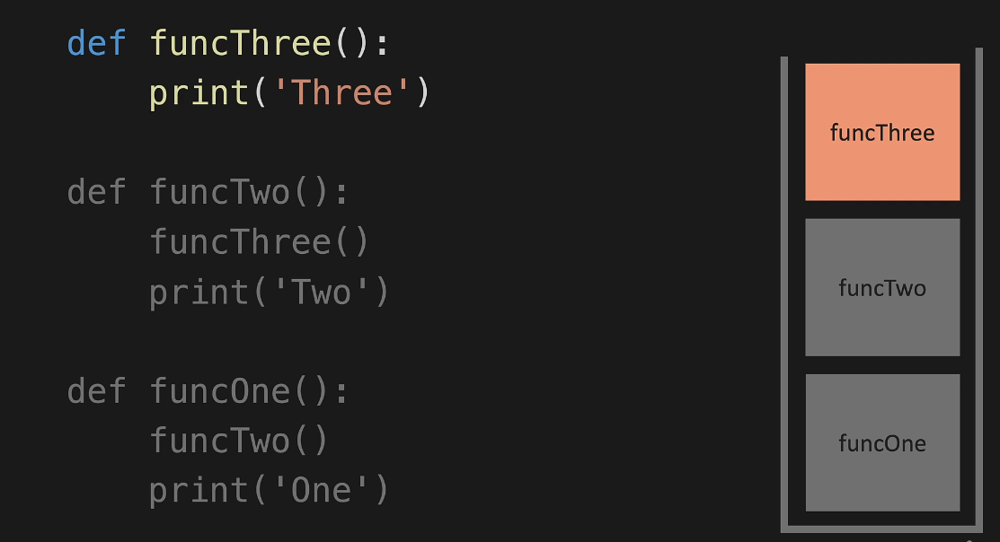
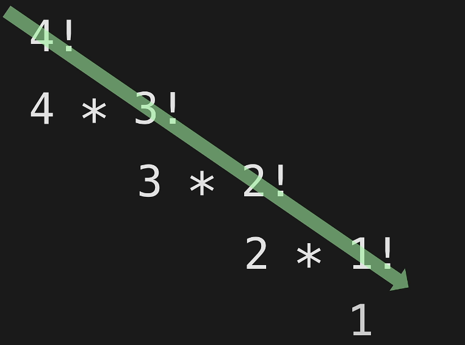

# Algorithms - Recursion
***
***
# Rescursion Intro
* a function that calls itself ... until it doesnt 
* when your function returns what you want that is called the base case
    * base case has to return something
* when your function needs to continue that is called the recursive case


***
***
# Recursion - Call Stack
* (non recursive)

```
def funcThree():
    print('Three')

def funcTwo():
    funcThree()
    print('Two')

def funcOne():
    funcTwo()
    print('One')


funcOne()
```
* example call stack 
* 
    * function 3 runs then is popped from the call stack
    * function 2 then is at the top of the call stack  because it was waiting on function 3
    * function 1 was waiting on function 2 to run. Once function 2 is popped from the call stack fuction 1 runs
    * so it prints out in this order ... three, two, one (not one, two, three)
        * it prints in this order because its the order that code comes off of the call stack

***
***
# Recursion - Factorial 
* 4! means 4 factorial 
    * this means 4 * 3 * 2 * 1
    * you could also say that 4 * 3! is == to 4! ... etc...
    * so if you look at it like that then the problem is getting smaller each time
    * 
    * the problem needs to be getting smaller as you call it
```
def factorial(n):
    if n == 1:
        return 1
    return n * factorial(n-1)


print(factorial(4))
```

***
***